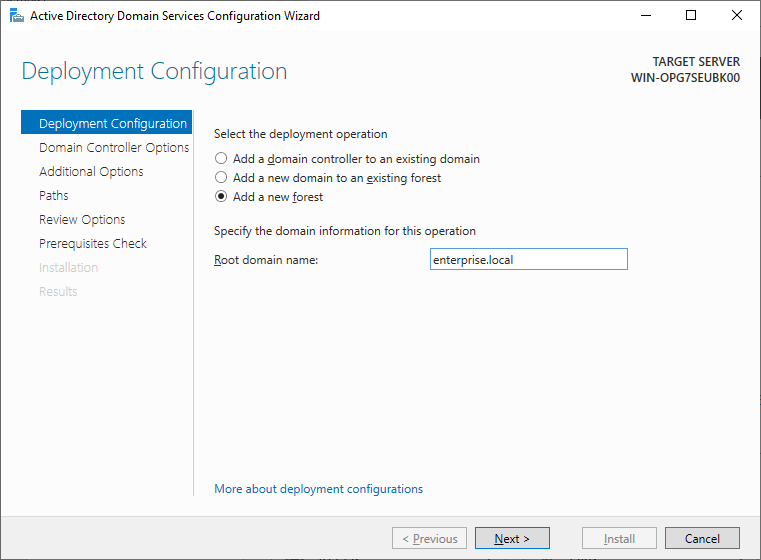
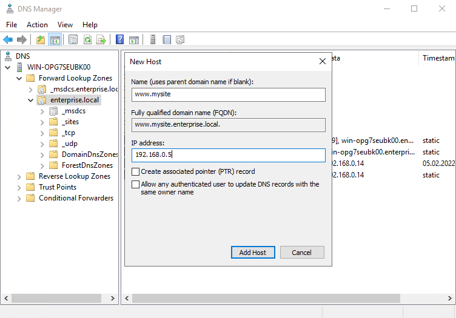
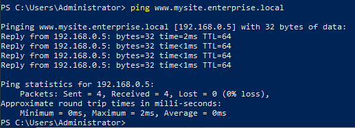
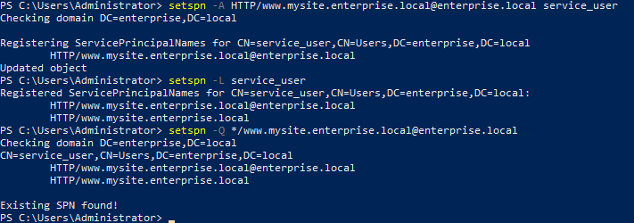
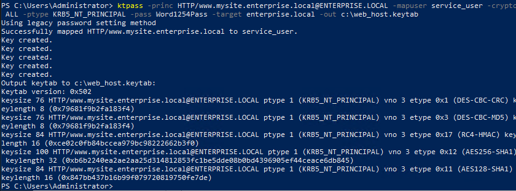
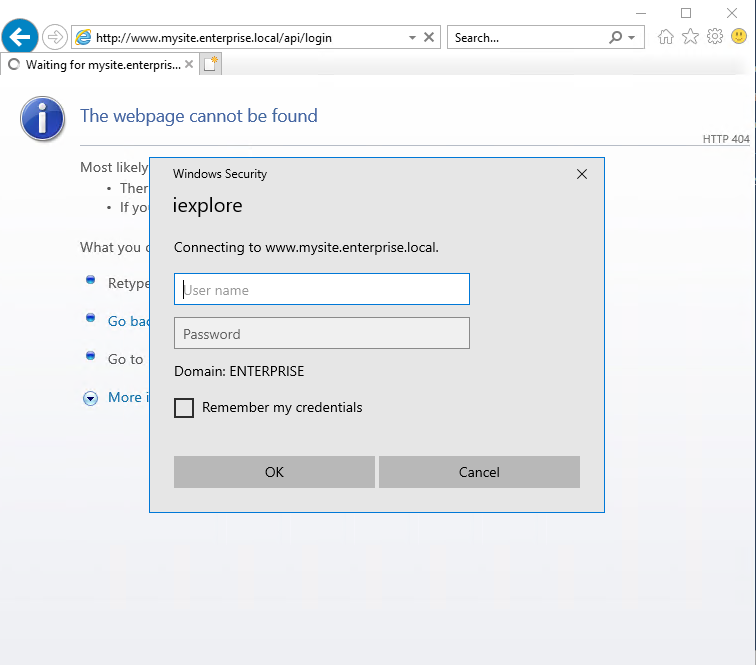
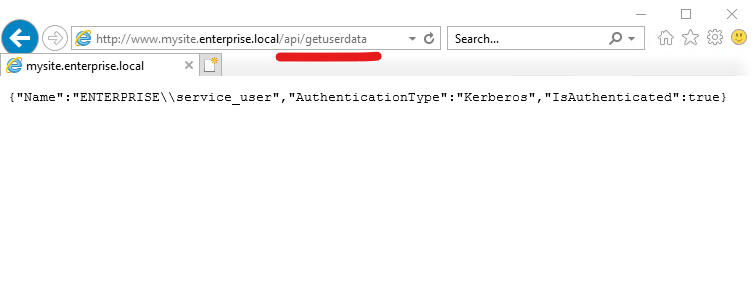

# Настраиваем доменную авторизацию на связке nxinx - ASP.Net - LDAP 
## Начальные условия

- Windows Server 2019 Standard. 10.0.17763 N/A Build 17763. Пустой, без домена. IP : 192.168.0.14
- CentOS Stream release 8. IP : 192.168.0.5

## Настройка Windows Server 
Здесь нет ничего сложного, по-этому без лишних подробностей. 
1. Создадим домен. В качестве имени домена будем использовать "enterprise.local". Для этого открываем Server Manager и устанавливаем AD Domain Services и DNS. 
      
2. Добавим сервисного пользователя через интефейс или командную строку.
```console
New-ADUser -Name "service_user" -GivenName "Ldap Auth User" -SamAccountName "service_user" -UserPrincipalName "service_user@enterprise.local" -Path "CN=Users,DC=enterprise,DC=local" –AccountPassword (ConvertTo-SecureString "Word1254Pass" -AsPlainText -force) -Enabled $true
```


```console
Get-ADUser service_user |  Set-ADUser -PasswordNeverExpires:$True -CannotChangePassword:$true
```

Авторизация не будет работать по IP-адресу, так что CentOS сервер должен иметь определенное имя. В моем случае у сервера есть только IP, так что я развернул DNS и добавил туда AAAA запись www.mysite.enterprise.local:



Проверим работу DNS:



Добавим и проверим запись SPN: 
```console
setspn -A HTTP/www.mysite.enterprise.local@enterprise.local service_user
```
```console
setspn -L service_user
```
```console
setspn -Q */www.mysite.enterprise.local@enterprise.local
```



На этом настройка сервера закончена. 

## Генерируем Keytab-файл. 

Используем следующий шаблон для генерации Keytab-файла:

```console
ktpass -princ HTTP/<MY_SITE_NAME>@<MY_DOMAIN_IN_UPPERCASE> -mapuser <MY_SERVICE_USER>@<MY_DOMAIN> -crypto ALL -ptype KRB5_NT_PRINCIPAL -pass <MY_SERVICE_USER_PASSWORD> -target <MY_DOMAIN> -out c:\web_host.keytab
```

В моем случае будет:

```console
ktpass -princ HTTP/www.mysite.enterprise.local@ENTERPRISE.LOCAL -mapuser service_user -crypto ALL -ptype KRB5_NT_PRINCIPAL -pass Word1254Pass -target enterprise.local -out c:\web_host.keytab
```



На этом мы закончили работу над сервером. Переходим к CentOS.

## Работа с CentOS 

Нам понадобится установить docker и docker-compose. 

В соответствии с [интрукцией](https://docs.docker.com/engine/install/centos/),  установим docker: 

```console 
yum install -y yum-utils
```

```console
yum-config-manager \ --add-repo \ https://download.docker.com/linux/centos/docker-ce.repo
```

```console
yum install -y docker-ce docker-ce-cli containerd.io
```

```console
systemctl enable docker && systemctl start docker`
```

```console
docker --version
```

И [docker-compose](https://docs.docker.com/compose/install/): 

```console
curl -L "https://github.com/docker/compose/releases/download/v2.2.3/docker-compose-linux-x86_64" -o /usr/local/bin/docker-compose
```

```console
chmod +x /usr/local/bin/docker-compose
```

```console
ln -s /usr/local/bin/docker-compose /usr/bin/docker-compose
```

```console
docker-compose --version
```

Мы выполнили все необходимые настройки и можем приступать к развертыванию. 

## Развертывание приложения ASP.Net 

> Нашей задачей будет развернуть приложение на ASP.Net 6. Приложение должно поддерживать доменную авторизацию. В качестве [проксирующего веб-сервера](https://docs.microsoft.com/en-us/aspnet/core/fundamentals/servers/kestrel/when-to-use-a-reverse-proxy?view=aspnetcore-6.0) мы будем использовать nginx.

Для этого копируем содержимое папки app на сервер CentOS и запускаем проект. 
Не забываем положить в папку app/WebApi свой Keytab.

```console 
docker-compose up -d --build 
```

## Проверяем работу

Переходим по пути `http://www.mysite.enterprise.local/api/login` и вводим логин и пароль доменного пользователя.



Если все прошло успешно, то, если мы перейдем по пути `http://www.mysite.enterprise.local/api/getuserdata`, должны получить информацию об авторизованном пользователе.

